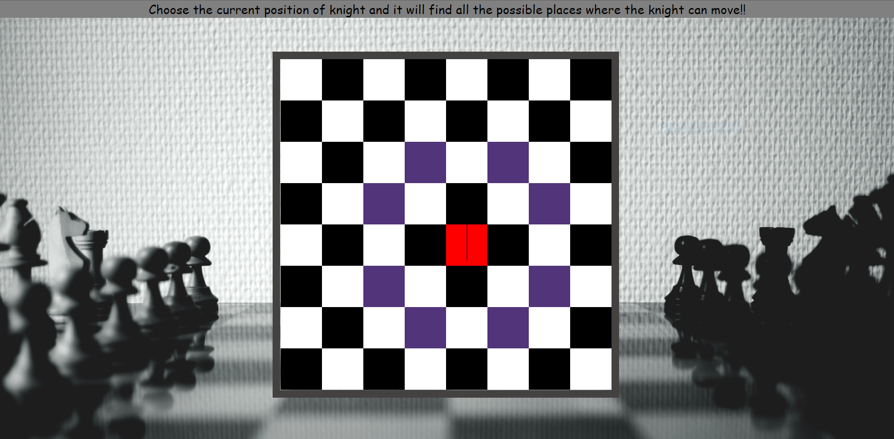

Click on any position of chessboard. 
The clicked position will turn to be in red background. 
Then the relative position from that current position where knight can move will be highlighted using blue background colour.
